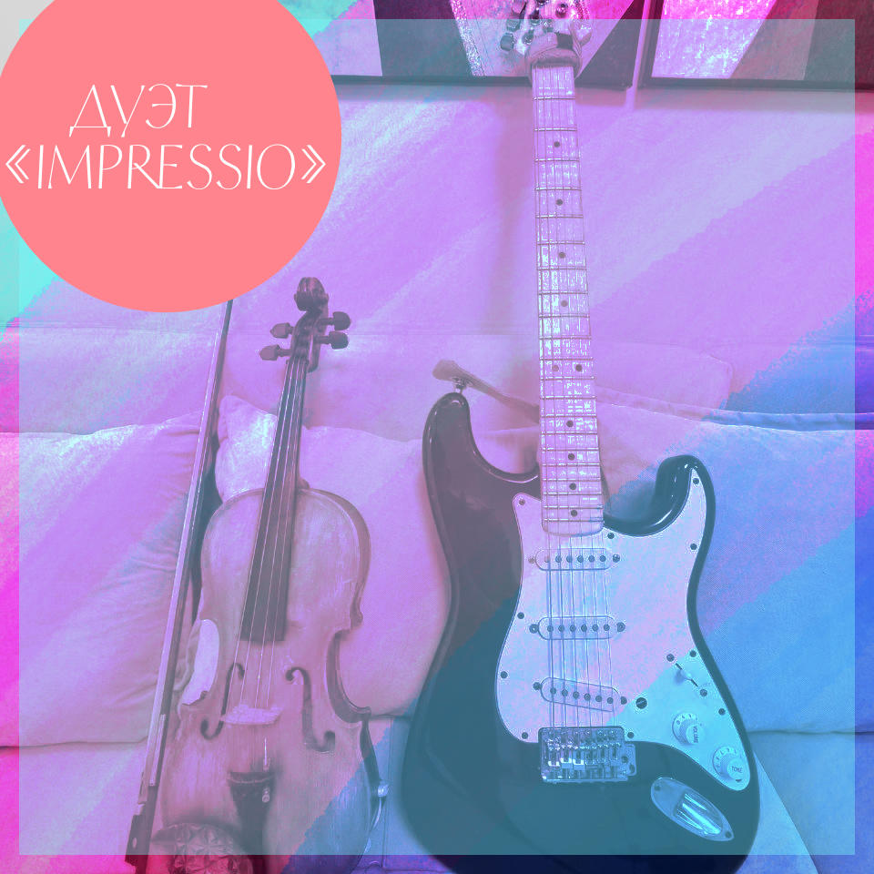

<h1 data-testid="page-title">Music</h1>

<dl>
    <dt></dt>
    <dd class="music"><a href="http://zvonko.link/trains">Асфальт43</a> art-rock project: <a href="https://open.spotify.com/album/1Gmuu5bDuHlSefaErbB2s8">Spotify</a> | <a href="https://music.apple.com/us/album/%D0%BF%D0%BE%D0%B5%D0%B7%D0%B4%D0%B0/1712868361?i=1712868363&at=1000lHKX&ct=odesli_http&itsct=odsl_m&itscg=30200&ls=1">Apple</a> | <a href="https://music.youtube.com/watch?v=VziK-FySeO8">YouTube Music</a> |  <a href="https://music.yandex.ru/album/27877442">Yandex</a></dd>
    <dt></dt>
    <dd class="music"><a href="https://one.link/impressio">impressio</a> Violin and Guitar duet: <a href="https://www.instagram.com/duoimpressio/">instagram</a> | <a href="https://www.youtube.com/watch?v=1amS3u1L7rM&ab_channel=AlexeiVanyashin">YouTube</a></dd>
    <dt></dt>
    <dd class="music"><a href="https://soundcloud.com/alexeiva/sets/instrumentals">Instrumentals</a> on soundcloud</dd>
</dl>

<dl>
    <dt>Royalty Free Music</dt>
    <dd>I am happy to provide my music for commercial projects, please contact me at no spam here please a&#x40;&#x63;&#x79;&#x72;&#x65;&#x61;&#x6c;&#x2e;&#x6f;&#x72;&#x67;</dd>
</dl>

