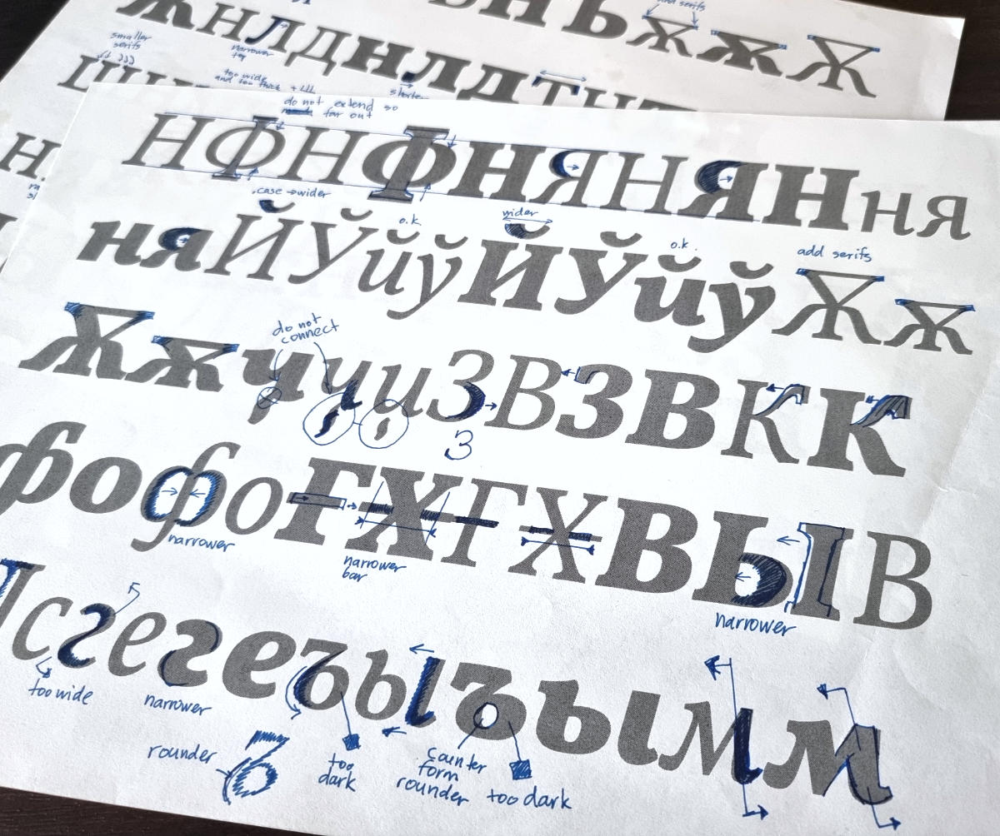

<h1 data-testid="page-title">Services</h1>

<ul>
    <li>Custom Font Design</li>
    <li>Logo Design and Refinement</li>
    <li>Cyrillic Extensions of Typefaces</li>
    <li>Native Cyrillic Expert Consultation</li>
    <li>Typeface Development (modifications, glyphs set expansion)</li>
</ul>

<dl>
    <dt>Toolset</dt>
    <dd>Glyphs App[main], RoboFont/FontLab[secondary], MetricsMachine, github, python scripting, fonttools, fontbakery</dd>
</dl>

